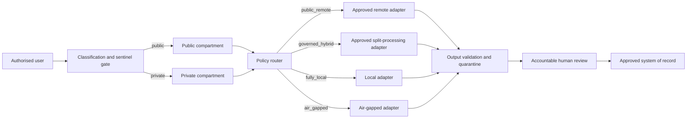

# Track 03 fit-gap and threat model

## Existing-system boundary

Approved organisational identity, device, key management, access control,
audit, records, backup, incident-response, and legal/policy processes remain
authoritative. The workbench does not implement authentication, enterprise
key custody, records disposal, privilege determination, or production
monitoring. Its smallest owned gap is a portable fail-closed contract for
classification, execution-mode routing, disclosure, compartment naming,
adversarial sentinels, quarantine, and assurance receipts.

## Standards baseline verified 2026-08-29

- [NIST AI RMF 1.0](https://www.nist.gov/itl/ai-risk-management-framework):
  voluntary Govern, Map, Measure, and Manage structure; NIST states that a
  revision is under development, so drift invalidates the mapping.
- [NIST AI 600-1](https://doi.org/10.6028/NIST.AI.600-1), *Generative
  Artificial Intelligence Profile* (2024): cross-sectoral companion profile.
- [NIST Privacy Framework 1.0](https://www.nist.gov/privacy-framework/privacy-framework)
  (January 2020): privacy risk-management baseline; future revisions require
  review.
- [OWASP GenAI LLM Top 10 2026](https://owasp.org/www-project-top-10-for-large-language-model-applications/):
  current release published 2026-08-04; the implementation covers prompt
  injection, sensitive disclosure, supply chain, poisoning, unsafe output,
  excessive agency, prompt leakage, retrieval weaknesses, misinformation, and
  unbounded consumption as threat categories, not certification controls.
- [MITRE ATLAS](https://atlas.mitre.org/): living AI adversary knowledge base;
  no fixed-version conformance claim is made.
- OpenSSF/SLSA, SPDX, and CycloneDX remain supply-chain mapping candidates;
  repository dependency review and pinned revisions supplement, but do not
  certify, those frameworks.

## Trust zones and data flows

Stores, indexes, caches, queues, logs, and receipts use distinct compartment
keys. Local-only modes reject non-local destinations. Unknown classification,
mode, egress, telemetry, or model provenance fails closed.

## Threats, harms, and controls

| Threat or misuse | Plausible harm | Core control | Enterprise authority |
|---|---|---|---|
| re-identification or inference | privacy breach or participant harm | minimum data, placeholder/sentinel tests, explicit classification | privacy office and approved de-identification process |
| prompt injection or active content | instruction bypass, unsafe tools, disclosure | inert scanning, no execution, quarantine, least privilege | endpoint, sandbox, and application security controls |
| poisoned retrieval or source | false evidence or unsafe recommendation | provenance, source state, conflicting evidence, human review | approved content and records platform |
| supply-chain compromise or remote code | code execution, data loss | pinned dependencies, dependency review, no remote code by default | organisational software assurance |
| model/tool provenance unknown | unreviewable or unsafe output | execution disclosure and fail-closed routing | AI/model governance |
| telemetry, log, cache, or index leakage | persistent private-data exposure | separated compartments, telemetry-known gate, bounded diagnostics | platform logging, retention, and access controls |
| insider or excessive agency | unauthorised access or external action | accountable roles, ordinary client permissions, no automatic approval | identity, access, employment, and audit systems |
| culturally unsafe or blame-oriented output | participant harm and inequitable review | explicit consultation, participation, Just Culture and human review | approved cultural-safety governance |

## Dependency lifecycle

The locked core is Python and JSON Schema using the repository environment.
Enterprise controls are connectors owned by deployment organisations. Model,
retrieval, and client capabilities remain optional adapters. Compatibility is
the supported Python window and schema versions validated in CI. Failure
isolation is denial/quarantine with explicit review; no adapter may silently
fall back to remote execution or plaintext. Project shims expire when a
maintained standard or organisational platform provides equivalent portable
contracts and tests.

No generic upstream defect was identified: the project-owned portion is the
domain-specific composition of privacy, evidence, clinical-safety,
cultural-safety, and authority gates.
