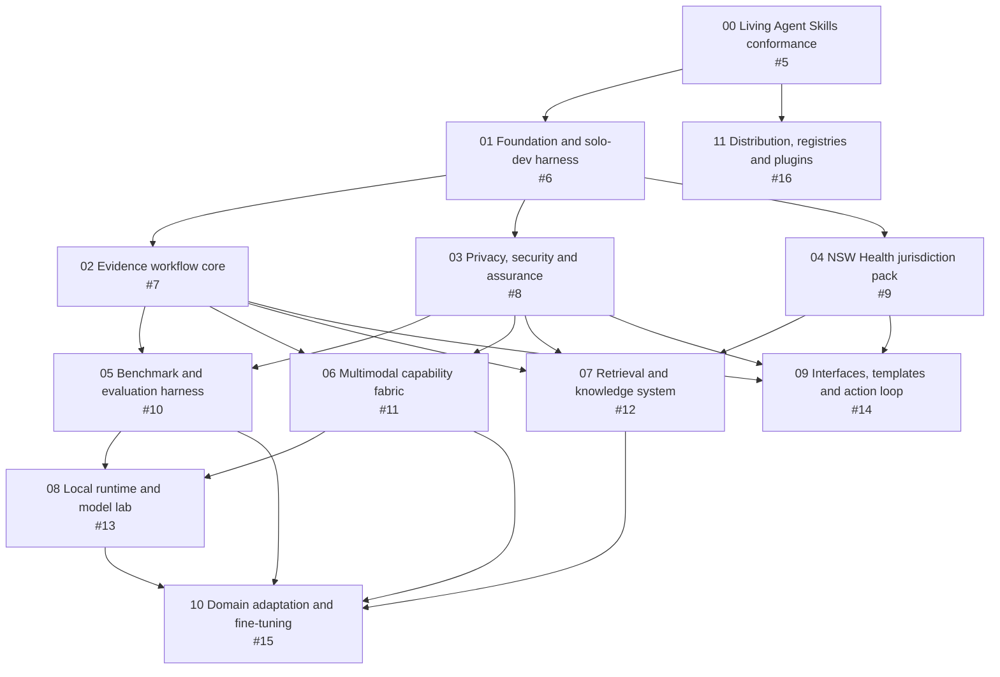

# Safety Systems Workbench Roadmap

## Portfolio

- **GitHub roadmap:** [#1](https://github.com/edithatogo/rcagent/issues/1)
- **Workstream A:** [#2 Foundation and Governance](https://github.com/edithatogo/rcagent/issues/2)
- **Workstream B:** [#3 Data, Models and Evaluation](https://github.com/edithatogo/rcagent/issues/3)
- **Workstream C:** [#4 Product, Interfaces and Distribution](https://github.com/edithatogo/rcagent/issues/4)
- **Execution model:** one integration lane plus at most two independent implementation lanes
- **Autonomy:** [continuous across tasks, phases, review, rework, and tracks](./autonomy.md); owner decisions use the contract in [workflow.md](./workflow.md)
- **Machine contract:** [autonomy.json](./autonomy.json)
- **Integration policy:** [integrate, configure, profile, extend, or contribute before building](./integration-strategy.md)
- **Capability policy:** keep the portable core minimal and make advanced
  capabilities independently installable through
  [governed profiles](./capability-profiles.md), idempotent scripts, and an
  agent-assisted runtime setup path that invokes the same scripts
- **System/dependency map:** [integration-map.json](./integration-map.json)

GitHub uses native nested subissues for portfolio ownership and native issue dependencies for hard-start blockers. Conductor distinguishes those hard blockers from later phase dependencies so useful foundation work can begin without over-serialising the programme.

## Continuous Portfolio Execution

An instruction to implement, proceed, continue, resume, or finish is standing
authorisation for all reversible work inside the approved roadmap. The runner
does not stop at phase or track boundaries. It verifies, reviews, applies
bounded rework, synchronizes evidence-backed documentation, reconciles state,
selects the next ready track, and continues.

Only the affected lane pauses for an owner decision or external wait. Its WIP
slot is released and independent work continues. The portfolio stops only
when all authorised work is complete, every remaining path needs owner input
or unavailable external action, a safety circuit breaker trips, or the owner
changes the objective.

## Integration-First Portfolio Rule

The workbench fills demonstrated gaps around existing systems; it does not
replace them by default.

| Capability | Existing system remains authoritative | Project-owned gap |
|---|---|---|
| Incident notification and required incident record | ims+ or another approved incident system | Bounded ingest/export, evidence analysis, provenance, and reconciliation |
| Enterprise records, content, identity, and collaboration | Approved organisational platforms | Local privacy-preserving processing and thin connectors |
| Adaptive and predictable workflow | Existing workflow platform; CMMN/BPMN/DMN standards | Safety-specific profiles, validation, and interoperability |
| Clinical exchange | Source clinical system and supported HL7 FHIR profile | Investigation mapping and evidence boundaries |
| Provenance and packaging | W3C PROV and evaluated packaging standards | Healthcare investigation semantics and safety constraints |
| Evaluation | Inspect AI as primary candidate plus specialist adapters | Clinical cases, rubrics, privacy and safety hard gates |
| Retrieval | Existing lexical, vector, and orchestration frameworks | Authority, rights, compartments, citations, drift, and abstention |
| Model inference and training | Maintained runtimes and training frameworks | Device profiles, routing, benchmarks, governance, and domain adapters |
| User surface and reporting | Existing enterprise surfaces and maintained document tools | Only demonstrated privacy, analysis, and evidence-review gaps |

Every track starts with a fit-gap phase. New project capability requires
evidence that configuration, standards mapping, a dependency, an adapter, and
an upstream contribution are inadequate. Generic gaps should be addressed
upstream; local shims must be temporary and replaceable.

## Dependency Graph

Later phase gates not drawn as hard-start arrows:

- Track 04 integrates against the Track 02 evidence and Track 03 privacy contracts.
- Track 05 consumes jurisdiction scenarios from Track 04.
- Track 06 consumes benchmark contracts from Track 05.
- Track 07 earns vector, hybrid, and reranking stages through Tracks 05 and 06.
- Track 08 consumes retrieval scenarios from Track 07.
- Track 09 consumes multimodal and retrieval capabilities from Tracks 06 and 07.
- Track 10 also consumes applicable Track 03 and Track 04 governance.
- Track 11 can package portable skills after Track 00; client-plugin submission evidence waits for Tracks 01, 03, 05, and 09.

## Track Portfolio

| Track | GitHub | Workstream | Hard start blockers | Primary outcome |
|---|---:|---|---|---|
| [00 Agent Skills living conformance](./tracks/agent-skills-living-conformance_20260731/index.md) | [#5](https://github.com/edithatogo/rcagent/issues/5) | A | None | Portable core, governed extensions, adapters, validators, evals, and drift checks |
| [01 Safety systems foundation](./tracks/safety-systems-foundation_20260731/index.md) | [#6](https://github.com/edithatogo/rcagent/issues/6) | A | None; 00 gates licence/release-dependent phases | Product architecture, maximal harness, context system, and autonomous queue |
| [02 Evidence workflow core](./archive/evidence-workflow-core_20260731/index.md) | [#7](https://github.com/edithatogo/rcagent/issues/7) | A | 01 | Canonical evidence, claim, workflow, provenance, audit, and interchange contracts |
| [03 Privacy, security and assurance](./archive/privacy-security-assurance_20260731/index.md) | [#8](https://github.com/edithatogo/rcagent/issues/8) | A | 01 | Remote, hybrid, local, and air-gapped safeguards and assurance |
| [04 NSW Health jurisdiction pack](./tracks/nsw-health-jurisdiction-pack_20260731/index.md) | [#9](https://github.com/edithatogo/rcagent/issues/9) | A | 01 | Authoritative policy registry, workflow mapping, templates, and drift |
| [05 Benchmark and evaluation harness](./archive/benchmark-evaluation-harness_20260731/index.md) | [#10](https://github.com/edithatogo/rcagent/issues/10) | B | 02, 03 | Benchmark-first quality, safety, privacy, retrieval, and device assurance |
| [06 Multimodal capability fabric](./tracks/multimodal-capability-fabric_20260731/index.md) | [#11](https://github.com/edithatogo/rcagent/issues/11) | B | 02, 03 | OCR, encoders, speech, image/DICOM, and ECG adapters with limits |
| [07 Retrieval and knowledge system](./tracks/retrieval-knowledge-system_20260731/index.md) | [#12](https://github.com/edithatogo/rcagent/issues/12) | B | 02, 03, 04 | Citation-first lexical, vector, hybrid, and reranking system |
| [08 Local runtime and model lab](./tracks/local-runtime-model-lab_20260731/index.md) | [#13](https://github.com/edithatogo/rcagent/issues/13) | B | 05, 06 | Device-specific runtime and model evidence, routing, and offline packages |
| [09 Interfaces, templates and action loop](./tracks/interfaces-templates-action-loop_20260731/index.md) | [#14](https://github.com/edithatogo/rcagent/issues/14) | C | 02, 03, 04 | Usable investigation, disclosure, action, and effectiveness workflows |
| [10 Domain adaptation and fine-tuning](./tracks/domain-adaptation-finetuning_20260731/index.md) | [#15](https://github.com/edithatogo/rcagent/issues/15) | B | 05, 06, 07, 08 | Evidence-gated medical model comparison and optional adaptation |
| [11 Distribution, registries and plugins](./tracks/distribution-registries-plugins_20260731/index.md) | [#16](https://github.com/edithatogo/rcagent/issues/16) | C | 00 | Portable releases, registry assessment, Claude and OpenAI packages |

Cross-cutting repository hardening is coordinated by
[#18](https://github.com/edithatogo/rcagent/issues/18), with
[#17](https://github.com/edithatogo/rcagent/issues/17) incorporated into
Tracks 01 and 03. These issues refine existing acceptance criteria rather than
creating parallel tracks.

## Delivery Waves

These waves describe the recommended order, not a promise to keep every listed track active simultaneously.

## Clinical Governance Capability Architecture

The portfolio is nested around the
[clinical-governance system-of-systems map](./clinical-governance-architecture.md):

1. **Incident lifecycle:** submission, huddle, provisional risk and harm
   assessment, review path and team, evidence acquisition, chronology and
   problem lists, interviews and analysis, related-policy pathways, findings,
   literature-informed recommendations, actions, effectiveness and closure.
2. **Shared services:** evidence and provenance, policy authority, privacy and
   safety, literature and retrieval, SourceRight citation integrity, data
   analysis, multimodal processing, documents, diagrams, and evaluation.
3. **Specialist domains:** enterprise and clinical risk, lookback, cluster
   review, quality measures, individual clinician or worker review, Just
   Culture, cultural assessment, quality improvement and redesign,
   medicolegal/regulatory review, and proactive safety.
4. **Organisational learning:** governed federated access to incident history,
   prior serious-adverse-event reviews, findings, recommendations, action
   effectiveness, comparative benchmarking, operational data, and
   quality-and-safety measures.

Tracks 02, 04, 07, and 09 deliver the first end-to-end vertical slice. A
specialist capability becomes a separate track, skill, agent, workflow,
domain pack, or plugin only when the map's extraction criteria are evidenced;
otherwise it remains an integrated module using the shared contracts.

### Wave 0: Standards Gate

- Integration lane: Track 00
- Exit: living conformance, portable-core contract, adapters, validator/eval baseline, and upstream-drift receipt

### Wave 1: Product and Harness Foundation

- Integration lane: Track 01
- Exit: product boundary, architecture, dependency graph, existing-system inventory, fit-gap register, bounded context system, definitions of ready/done, command contracts, and decision governance

### Wave 2: Three Foundation Lanes

- Integration lane: Track 02 evidence and workflow contracts
- Independent lane: Track 03 privacy, security, and assurance
- Independent lane: Track 04 source registry and policy mapping
- Integration point: NSW workflow mappings bind to the evidence and privacy contracts

### Wave 3: Capability and Product Fan-Out

- Integration lane: Track 05 benchmark harness
- Independent lane: Track 06 multimodal adapters
- Independent lane: Track 09 user journeys and deterministic workflow templates
- Track 07 begins its lexical and corpus foundation when Tracks 02–04 pass
- Track 11 may prepare private portable-skill packaging without publishing

### Wave 4: Measured Intelligence

- Integration lane: Track 07 hybrid retrieval convergence
- Independent lane: Track 08 device and model lab
- Independent lane: Track 09 interface and action-loop integration
- Track 11 prepares client packages and current submission evidence

### Wave 5: Adaptation and Distribution Decisions

- Track 10 evaluates domain models and fine-tuning only if benchmark evidence identifies a justified gap
- Track 11 presents owner decisions for each public release, registry, marketplace, or plugin-directory submission
- Portfolio closeout verifies privacy modes, policy drift, device profiles, maintenance, and reproducibility

## Maximal Harness and Context Strategy

Track 01 creates the shared delivery harness. Every later track must consume it rather than inventing a private workflow.

The target command surface is:

| Command contract | Purpose |
|---|---|
| `doctor` | Verify environment, device, dependencies, sources, models, network, privacy mode, and freshness |
| `context` | Assemble a bounded, source-linked context pack for one ready task |
| `queue` | Select the highest-value unblocked task under WIP and decision constraints |
| `validate` | Run skills, schemas, links, fixtures, contracts, privacy, safety, policy, and adapter checks |
| `eval` | Run reproducible deterministic and model-assisted benchmark suites |
| `receipts` | Record exact revisions, commands, environments, results, limitations, risks, and decisions |
| `reconcile` | Compare Conductor, Git, GitHub, CI, sources, benchmarks, releases, and external state |

Context is layered: repository navigation, product constraints, track scope, bounded task pack, exact sources and fixtures, then client-specific instructions only when needed. Freshness and provenance are mandatory; token volume is not a substitute for context quality.

## Model and Multimodal Strategy

1. Establish deterministic and generic-model baselines.
2. Add full-text retrieval before vectors.
3. Evaluate encoders, hybrid retrieval, and reranking separately.
4. Establish multimodal contracts and safety-disabled clinical interpretation.
5. Measure exact model revisions on explicit device profiles.
6. Prefer the smallest configuration that passes quality, privacy, safety, latency, memory, and maintenance gates.
7. Evaluate medical/domain models against generic baselines.
8. Fine-tune only after a readiness decision shows a material remaining gap.

Candidate names are hypotheses. Track 08 must verify availability, licence, revision, format, context, device fit, and actual performance at the time of evaluation.

## Horizon: Aggregate Quality and Safety Analytics

Post-Wave-5 analytical capabilities for portfolio consideration. None are
delivery dependencies today; each requires an owner decision gate before any
private, identifiable, or hosted data flows, and each stays deterministic and
no-model-download until Tracks 05–08 produce passing receipts.

| Candidate | Purpose | Primary tooling | Gate notes |
|---|---|---|---|
| FHIR-based quality exchange | Share AdverseEvent/Provenance records between systems | HL7 FHIR R5 (already an interchange option in `integration-strategy.md`) | Interchange only; never the internal investigation ontology |
| OMOP CDM mapping | Aggregate de-identified outcomes across sites for research queries | OHDSI OMOP CDM v5.x + common data model vocabulary | De-identification assurance from Track 03 first; mapping is one-way export |
| Process mining | Discover conformance/deviation between documented and actual care/investigation pathways | Python: pm4py; R alternatives: bupaR family (`pm4rs` naming unverified — treat as candidate name only) | Event logs derived only from evidence-ledger-backed datasets |
| Statistical process control | Detect drift in incident rates, recommendation closure times | Deterministic SPC chart libraries | Cheap, privacy-safe, likely first horizon item worth a spike |
| Incident-text NLP | Theme extraction across large incident corpora | Local encoders via Track 06/07 contracts | Human-reviewable output only; no autonomous classification of severity |

Sequence these behind the Delivery Waves above; propose concrete tracks only
after Wave 4 evidence exists, so they enter as measured extensions rather than
speculative subsystems.

## Registry and Marketplace Funnel

Track 11 uses a governed funnel:

1. **Canonical GitHub package:** versioned, self-contained portable skills with checksums, licences, provenance, compatibility, clean-install tests, rollback, and no public release without approval.
2. **Agent Skills discovery:** track the official standard and examples; assess GitHub installation, skills.sh or current equivalents, and community catalogues without assuming an official universal registry.
3. **Claude Code:** test a self-hosted GitHub marketplace and plugin, then prepare an optional official marketplace submission.
4. **Codex and OpenAI:** test the current plugin manifest, `agents/openai.yaml`, and any justified app or MCP declarations, then prepare an optional universal plugin-directory submission.
5. **Other clients:** use the same adapter, compatibility, privacy, maintenance, deprecation, and rollback profile.

Every external publication or submission is a separate owner decision. Packaging readiness does not imply publication.

## Portfolio Decision Gates

Owner decisions are required for:

- clinical, legal, policy, privilege, regulatory, employment, or records interpretation;
- real private data, new network egress, credentials, paid compute, or external services;
- licences, restricted templates, model/data distribution, and support commitments;
- residual privacy, security, cultural-safety, or clinical-safety risk;
- public releases, registry or marketplace submissions, and publisher verification; and
- destructive migration or irreversible product and architecture choices.

All other reversible work inside an approved track proceeds autonomously when
its evidence gates pass. A decision request presents a recommended option
first, its rationale and evidence, viable alternatives, trade-offs,
reversibility, safe default, paused scope, continuing work, and dependency or
schedule impact.
