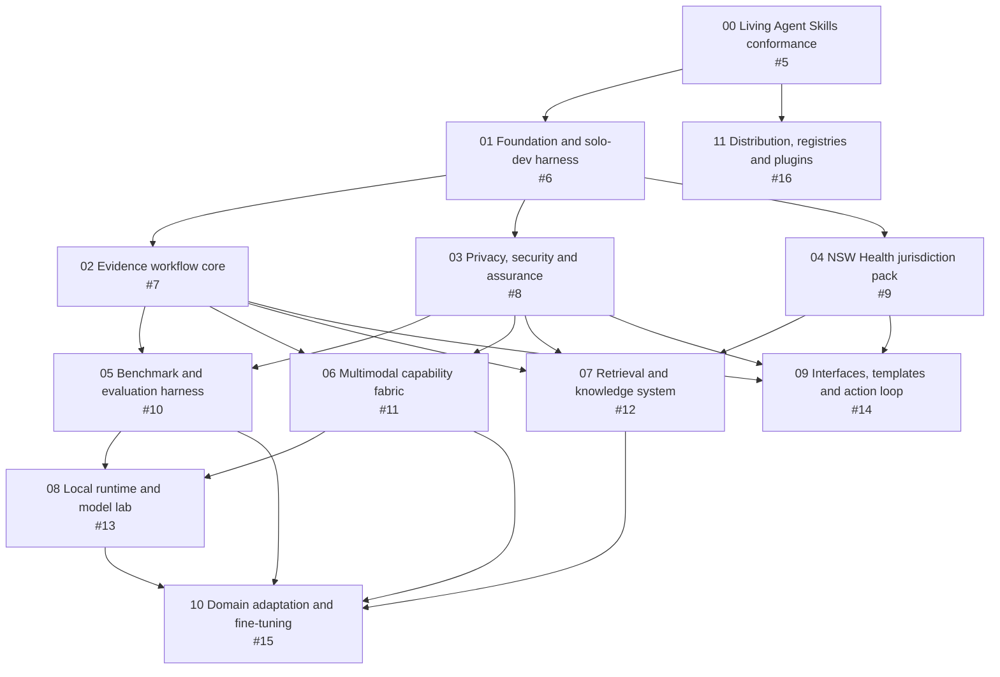

# Safety Systems Workbench Roadmap

## Portfolio

- **GitHub roadmap:** [#1](https://github.com/edithatogo/rcagent/issues/1)
- **Workstream A:** [#2 Foundation and Governance](https://github.com/edithatogo/rcagent/issues/2)
- **Workstream B:** [#3 Data, Models and Evaluation](https://github.com/edithatogo/rcagent/issues/3)
- **Workstream C:** [#4 Product, Interfaces and Distribution](https://github.com/edithatogo/rcagent/issues/4)
- **Execution model:** one integration lane plus at most two independent implementation lanes
- **Autonomy:** reversible in-scope work proceeds automatically; owner decisions use the contract in [workflow.md](./workflow.md)

GitHub uses native nested subissues for portfolio ownership and native issue dependencies for hard-start blockers. Conductor distinguishes those hard blockers from later phase dependencies so useful foundation work can begin without over-serialising the programme.

## Dependency Graph

Later phase gates not drawn as hard-start arrows:

- Track 04 integrates against the Track 02 evidence and Track 03 privacy contracts.
- Track 05 consumes jurisdiction scenarios from Track 04.
- Track 06 consumes benchmark contracts from Track 05.
- Track 07 earns vector, hybrid, and reranking stages through Tracks 05 and 06.
- Track 08 consumes retrieval scenarios from Track 07.
- Track 09 consumes multimodal and retrieval capabilities from Tracks 06 and 07.
- Track 10 also consumes applicable Track 03 and Track 04 governance.
- Track 11 can package portable skills after Track 00; client-plugin submission evidence waits for Tracks 01, 03, 05, and 09.

## Track Portfolio

| Track | GitHub | Workstream | Hard start blockers | Primary outcome |
|---|---:|---|---|---|
| [00 Agent Skills living conformance](./tracks/agent-skills-living-conformance_20260731/index.md) | [#5](https://github.com/edithatogo/rcagent/issues/5) | A | None | Portable core, governed extensions, adapters, validators, evals, and drift checks |
| [01 Safety systems foundation](./tracks/safety-systems-foundation_20260731/index.md) | [#6](https://github.com/edithatogo/rcagent/issues/6) | A | 00 | Product architecture, maximal harness, context system, and autonomous queue |
| [02 Evidence workflow core](./tracks/evidence-workflow-core_20260731/index.md) | [#7](https://github.com/edithatogo/rcagent/issues/7) | A | 01 | Canonical evidence, claim, workflow, provenance, audit, and interchange contracts |
| [03 Privacy, security and assurance](./tracks/privacy-security-assurance_20260731/index.md) | [#8](https://github.com/edithatogo/rcagent/issues/8) | A | 01 | Remote, hybrid, local, and air-gapped safeguards and assurance |
| [04 NSW Health jurisdiction pack](./tracks/nsw-health-jurisdiction-pack_20260731/index.md) | [#9](https://github.com/edithatogo/rcagent/issues/9) | A | 01 | Authoritative policy registry, workflow mapping, templates, and drift |
| [05 Benchmark and evaluation harness](./tracks/benchmark-evaluation-harness_20260731/index.md) | [#10](https://github.com/edithatogo/rcagent/issues/10) | B | 02, 03 | Benchmark-first quality, safety, privacy, retrieval, and device assurance |
| [06 Multimodal capability fabric](./tracks/multimodal-capability-fabric_20260731/index.md) | [#11](https://github.com/edithatogo/rcagent/issues/11) | B | 02, 03 | OCR, encoders, speech, image/DICOM, and ECG adapters with limits |
| [07 Retrieval and knowledge system](./tracks/retrieval-knowledge-system_20260731/index.md) | [#12](https://github.com/edithatogo/rcagent/issues/12) | B | 02, 03, 04 | Citation-first lexical, vector, hybrid, and reranking system |
| [08 Local runtime and model lab](./tracks/local-runtime-model-lab_20260731/index.md) | [#13](https://github.com/edithatogo/rcagent/issues/13) | B | 05, 06 | Device-specific runtime and model evidence, routing, and offline packages |
| [09 Interfaces, templates and action loop](./tracks/interfaces-templates-action-loop_20260731/index.md) | [#14](https://github.com/edithatogo/rcagent/issues/14) | C | 02, 03, 04 | Usable investigation, disclosure, action, and effectiveness workflows |
| [10 Domain adaptation and fine-tuning](./tracks/domain-adaptation-finetuning_20260731/index.md) | [#15](https://github.com/edithatogo/rcagent/issues/15) | B | 05, 06, 07, 08 | Evidence-gated medical model comparison and optional adaptation |
| [11 Distribution, registries and plugins](./tracks/distribution-registries-plugins_20260731/index.md) | [#16](https://github.com/edithatogo/rcagent/issues/16) | C | 00 | Portable releases, registry assessment, Claude and OpenAI packages |

## Delivery Waves

These waves describe the recommended order, not a promise to keep every listed track active simultaneously.

### Wave 0: Standards Gate

- Integration lane: Track 00
- Exit: living conformance, portable-core contract, adapters, validator/eval baseline, and upstream-drift receipt

### Wave 1: Product and Harness Foundation

- Integration lane: Track 01
- Exit: product boundary, architecture, dependency graph, bounded context system, definitions of ready/done, command contracts, and decision governance

### Wave 2: Three Foundation Lanes

- Integration lane: Track 02 evidence and workflow contracts
- Independent lane: Track 03 privacy, security, and assurance
- Independent lane: Track 04 source registry and policy mapping
- Integration point: NSW workflow mappings bind to the evidence and privacy contracts

### Wave 3: Capability and Product Fan-Out

- Integration lane: Track 05 benchmark harness
- Independent lane: Track 06 multimodal adapters
- Independent lane: Track 09 user journeys and deterministic workflow templates
- Track 07 begins its lexical and corpus foundation when Tracks 02–04 pass
- Track 11 may prepare private portable-skill packaging without publishing

### Wave 4: Measured Intelligence

- Integration lane: Track 07 hybrid retrieval convergence
- Independent lane: Track 08 device and model lab
- Independent lane: Track 09 interface and action-loop integration
- Track 11 prepares client packages and current submission evidence

### Wave 5: Adaptation and Distribution Decisions

- Track 10 evaluates domain models and fine-tuning only if benchmark evidence identifies a justified gap
- Track 11 presents owner decisions for each public release, registry, marketplace, or plugin-directory submission
- Portfolio closeout verifies privacy modes, policy drift, device profiles, maintenance, and reproducibility

## Maximal Harness and Context Strategy

Track 01 creates the shared delivery harness. Every later track must consume it rather than inventing a private workflow.

The target command surface is:

| Command contract | Purpose |
|---|---|
| `doctor` | Verify environment, device, dependencies, sources, models, network, privacy mode, and freshness |
| `context` | Assemble a bounded, source-linked context pack for one ready task |
| `queue` | Select the highest-value unblocked task under WIP and decision constraints |
| `validate` | Run skills, schemas, links, fixtures, contracts, privacy, safety, policy, and adapter checks |
| `eval` | Run reproducible deterministic and model-assisted benchmark suites |
| `receipts` | Record exact revisions, commands, environments, results, limitations, risks, and decisions |
| `reconcile` | Compare Conductor, Git, GitHub, CI, sources, benchmarks, releases, and external state |

Context is layered: repository navigation, product constraints, track scope, bounded task pack, exact sources and fixtures, then client-specific instructions only when needed. Freshness and provenance are mandatory; token volume is not a substitute for context quality.

## Model and Multimodal Strategy

1. Establish deterministic and generic-model baselines.
2. Add full-text retrieval before vectors.
3. Evaluate encoders, hybrid retrieval, and reranking separately.
4. Establish multimodal contracts and safety-disabled clinical interpretation.
5. Measure exact model revisions on explicit device profiles.
6. Prefer the smallest configuration that passes quality, privacy, safety, latency, memory, and maintenance gates.
7. Evaluate medical/domain models against generic baselines.
8. Fine-tune only after a readiness decision shows a material remaining gap.

Candidate names are hypotheses. Track 08 must verify availability, licence, revision, format, context, device fit, and actual performance at the time of evaluation.

## Registry and Marketplace Funnel

Track 11 uses a governed funnel:

1. **Canonical GitHub package:** versioned, self-contained portable skills with checksums, licences, provenance, compatibility, clean-install tests, rollback, and no public release without approval.
2. **Agent Skills discovery:** track the official standard and examples; assess GitHub installation, skills.sh or current equivalents, and community catalogues without assuming an official universal registry.
3. **Claude Code:** test a self-hosted GitHub marketplace and plugin, then prepare an optional official marketplace submission.
4. **Codex and OpenAI:** test the current plugin manifest, `agents/openai.yaml`, and any justified app or MCP declarations, then prepare an optional universal plugin-directory submission.
5. **Other clients:** use the same adapter, compatibility, privacy, maintenance, deprecation, and rollback profile.

Every external publication or submission is a separate owner decision. Packaging readiness does not imply publication.

## Portfolio Decision Gates

Owner decisions are required for:

- clinical, legal, policy, privilege, regulatory, employment, or records interpretation;
- real private data, new network egress, credentials, paid compute, or external services;
- licences, restricted templates, model/data distribution, and support commitments;
- residual privacy, security, cultural-safety, or clinical-safety risk;
- public releases, registry or marketplace submissions, and publisher verification; and
- destructive migration or irreversible product and architecture choices.

All other reversible work inside an approved track proceeds autonomously when its evidence gates pass.
